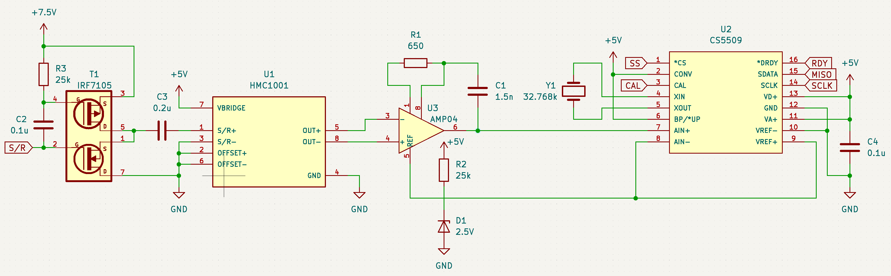
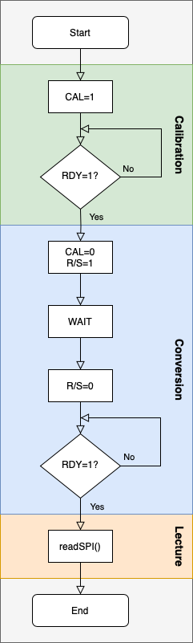

# Sysnav

## CODE EMBARQUÉ
## Test #1
J'ai commencé à développer la solution sous MacOS avant de réaliser que je ne pourrais pas compiler et donc tester mon code car les bibliothèques nécessaires ne sont plus disponibles. Je suis donc passé sur Windows où j'ai finalement réussi la compilation grâce à la commande suivante :
```
C:\"Program Files (x86)"\Microchip\xc16\v1.30\bin\xc16-gcc.exe -O0 -g -mcpu=33EP512MU814 -ILibC_reduite -ILibC_reduite/Os/Pic -ILibC_reduite/Os/Pic/Include33e -L "C:/Program Files (x86)/Microchip/xc16/v1.30/lib/dsPIC33E" -T .\LibC_reduite\Os\Pic\Include33e\p33EP512MU814.gld -o hello.elf .\system.c .\LibC_reduite\Os\Pic\Time\Time.c .\LibC_reduite\Os\Pic\Main\Main.c
```
On notera que j'utilise une ancienne version de xc16-gcc car les plus récentes ne supporte pas la libp dont la LibC_reduite se sert.
### Processus de validation
Une fois la compilation réussi et le fichier .elf généré, j'ai installé MPLAB X IDE qui contient un simulateur du 33EP512MU814.
J'ai configuré le simulateur pour avoir une fréquence de 16MHz. J'ai ensuite utilisé un watchdog sur la variable "global_time" et j'ai comparé la valeur affichée avec celle donnée par la stopwatch du logiciel.
Ainsi, la stopwatch indique :
```
Target halted. Stopwatch cycle count = 19113274 (2,389159 s)
```
Et la variable globale indique `2 380 000` ce qui correspond bien à 2,38s.<br><br>
**NB** - la variable globale ne se met à jour que toutes les 10ms mais la fonction `getTime()` est plus précise.

### Implémentation
J'ai voulu faire au plus simple, ce qui est important dans un système embarqué critique et en temps réel. Ainsi, j'ai utilisé le Timer1 du processeur avec un prescaler de 1:8 afin d'obtenir une clock de 1MHz (période de 1us). J'ai ensuite fait en sorte que le timer reset toutes les 10ms (10000 tocks) en lançant une interruption rapide qui incrémente une variable globale de temps et reset le timer. Ainsi, quand on appelle `getTime()`, on a juste à additionner la variable globale et la valeur actuelle du timer pour obtenir le temps.<br><br>
J'ai modifié le type Time pour que ce soit un uint64 capable de contenir 10h de tocks toutes les micro secondes et mon code doit éviter tout overflow.

## Test #2
### Processus de validation
J'ai fait en sorte que la boucle principale ajoute un élément toutes les demi secondes dans le buffer circulaire en me servant du `getTime()` de la partie précédente. En parallèle, j'ai configuré un deuxième timer (Timer2) pour qu'il supprime un élément toutes les secondes. On remarque que après quelques secondes, un élément n'est ajouté que toutes les secondes et non pas les demi secondes ce qui montre qu'il n'y a pas d'écrasement.

### Implémentation
J'ai choisi de faire un buffer circulaire simple. Tous les buffers du même type font la même taille et l'utilisateur a accès au struct. Ces simplicités permettent une implémentation moins volumineuse et modulaire que l'on peut rendre plus robuste facilement.

## ÉLECTRONIQUE
## Test #1
<br>
Le schéma ci-dessus est inspiré de la datasheet du HMC1001 fournie dans le dossier `Test_Electronique/Datasheets/`.
### Récupération des mesures
Pour récupérer des données du capteur, il est possible de suivre le flowchart ci-dessous. `S/R`, `CAL` et `RDY` correspondent aux signaux du même nom sur le schéma électrique. `readSPI()` fait référence aux pins `MISO`, `SCLK` et `SS`.<br>
<br>
